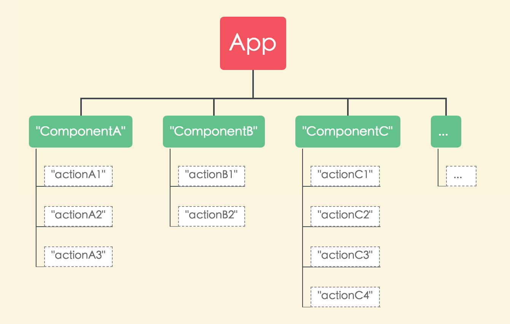

## 类介绍: IComponent.java


**名字解释**

组件类：
~~~  
实现了IComponent接口的类就是组件类

组件类是一个组件向其外部暴露服务的唯一入口，外部对组件的所有服务调用都是从该组件类的onCall方法进入到组件内部。
~~~
组件调用协议：
~~~
组件的实现方与调用方约定的一组规定，其中包含：
1. 组件名称：componentName, 获取方式：cc.getComponentName()
2. 服务名称：actionName,    获取方式：cc.getActionName()
3. 参数列表：params,        获取方式：cc.getParamItem(key)
4. 返回信息：data,          获取方式：ccResult.getDataItem(key)

申明：不管组件的服务是如何实现，也不管组件在哪个进程，只要组件的调用协议不变，其调用方式及代码都是一样的
~~~

### IComponent接口的定义


__注：请特别注意onCall方法返回值的说明（初学者容易忽视，Code Review时请重点检查）__

```java
/**
 * 组件接口
 * 注意：
 *   1. 此接口的实现类代表的是一个组件暴露给外部调用的入口
 *   2. 实现类必须含有一个无参构造方法，以供自动注册插件进行代码注入
 *   3. 实现类有且只有一个对象会被注册到组件库中，故不能为Activity、Fragment等
 */
public interface IComponent {

    /**
     * 定义组件名称
     * @return 组件的名称
     */
    String getName();

    /**
     * 调用此组件时执行的方法（此方法只在LocalCCInterceptor中被调用）
     * 注：执行完成后必须调用CC.sendCCResult(callId, CCResult.success(result));
     * cc.getContext() android的context，在组件被跨进程调用时，返回application对象
     * cc.getAction() 调用的action
     * cc.getParams() 调用参数
     * cc.getCallId() 调用id，用于通过CC向调用方发送调用结果
     * @param cc 调用信息
     * @return 是否延迟回调结果 {@link CC#sendCCResult(String callId, CCResult result)}
     *          false:否(同步实现，在return之前回调结果)
     *          true:是(异步实现，本次CC调用将等待回调结果)
     */
    boolean onCall(CC cc);
}
```

### 组件类的作用

在CC架构中，一个app是由多个组件所组成，一个组件对应一个组件类，一个组件类对应多个服务（action），如下图所示：




站在CC的视角，一个组件类就是一个组件。 

~~~
在实践中，我们通常将module作为组件，module中通常包含1个组件类（IComponent的实现类），将当前组件中需要暴露的服务在onCall方法中提供出去
如果某个module中含有多个组件类，它可以被看做是多个组件（如上图中的module4：它包含组件D及组件E）
~~~

每一次CC组件调用，最终都会调用到对应组件类的onCall方法，不管这个组件类在哪个module中、也不管它在哪个进程中


### 创建组件类

组件类（静态组件类）需要直接实现IComponent接口，具体创建方式及注意事项请参考[2. 创建组件][1]

动态组件类需要实现IDynamicComponent接口，具体说明请戳[这里][2]

### 自定义Base基类

直接实现IComponent接口(注意：是直接实现）的组件类会自动注册到ComponentManager中进行管理


**如果需要自定义一个基类**

请在你根目录下的`cc-settings-2.gradle`文件中添加以下代码，并修改其中`scanSuperClasses`的类名：

注意：如果基类不是抽象的(abstract)，也会被视作一个组件类被自动注册到ComponentManager中进行管理

```groovy
//自动注册组件
ccregister.registerInfo.add([ 
  'scanInterface'             : 'com.billy.cc.core.component.IComponent'
  //改成你的基类名称，可以有多个，用英文逗号隔开
  , 'scanSuperClasses'        : ['your.pkg.YourBaseComponent', 'your.pkg.YourBaseComponent2'] 
  , 'codeInsertToClassName'   : 'com.billy.cc.core.component.ComponentManager'
  , 'registerMethodName'      : 'registerComponent'
  //排除的类，支持正则表达式（包分隔符需要用/表示，不能用.）
  , 'exclude'                 : [ 'com.billy.cc.core.component.'.replaceAll("\\.", "/") + ".*" ]
])
```


[1]: #/integration-create-component
[2]: #/manual-IDynamicComponent
