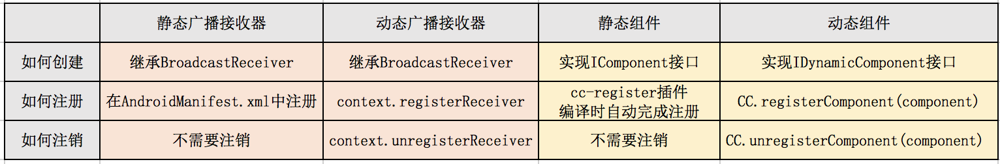

## 类介绍: IDynamicComponent.java

### 作用

通过实现IDynamicComponent接口来创建一个动态组件类

### 与静态组件的区别

先对比Android系统中的广播接收器(BroadcastReceiver)来理解一下：



另外，动态组件在注册它的进程中运行

- 动态组件不支持`@SubProcess`及`@AllProcess`注解
- 如：在主进程中调用`CC.registerComponent(dyComponent);`, dyComponent 将在主进程中运行

接口定义
```java
public interface IDynamicComponent extends IComponent {
}
```
可以看到IDynamicComponent继承了IComponent，其作为一个组件的功能与IComponent是一样的

差别是不会被自动注册到CC框架中，这也导致了它们用法上的差别
~~~
一个组件在注册到CC框架中之前，是无法通过CC调用到的
每个静态组件类只在自动注册时创建出1个对象，而动态组件类可以创建多个对象
    例如：在Activity中创建的动态组件
      如果该Activity同时存在多个对象（被打开多次）
      其中创建的动态组件对象也有多个
~~~

### 创建动态组件

因为ComponentManager中注册组件的[数据结构是一个Map][1]
~~~
key     ： 组件名称(componentName)
value   ： 组件对象(IComponent对象)
~~~

所以，动态组件需要保障每个对象的componentName不一样


具体用法请参考：[4. 监听登录状态][2]


[1]: https://github.com/luckybilly/CC/blob/master/cc/src/main/java/com/billy/cc/core/component/ComponentManager.java#L26
[2]: #/practice_4
